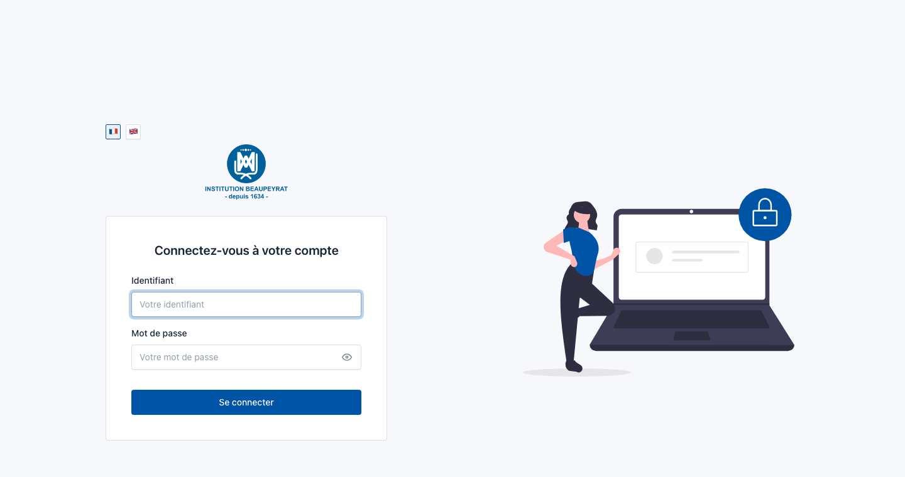
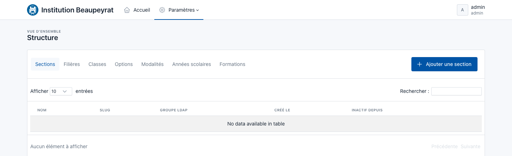

# MonCampus

A campus management platform for **Institution Beaupeyrat**, built on [Symfony](https://symfony.com)
and served by [FrankenPHP](https://frankenphp.dev)/[Caddy](https://caddyserver.com). Staff sign in with
their existing LDAP account and get a horizontal, [Tabler](https://tabler.io)-styled admin dashboard for
managing the school's directory and its academic structure.


<p align="center">
  
</p>

## What it does

- **LDAP authentication with just-in-time provisioning.** Users authenticate against the school's LDAP
  directory; on first login their identity is mirrored into a local `User` row so the rest of the app can
  attach relations (roles, locale, ...) to a stable entity instead of a transient LDAP identity.
- **Annuaire (Directory).** Browse LDAP users and groups, queue new-account/group creation requests for
  an external provisioning script to pick up, and run a one-off sync that creates a local `User` row for
  any LDAP account that doesn't have one yet — without ever touching or deleting existing rows.
- **Paramètres > Structure.** Manage the school's academic structure: a `Section > Track > Cohort`
  hierarchy, cross-cutting `Option`/`Modality` tags (e.g. SLAM, SISR, Alternance), and `SchoolYear`/
  `Program` pairings that tie a Cohort to a given year. Each of the seven views is its own route with its
  own paginated, searchable table, so switching tabs only loads the data for that tab.

<p align="center">
  
</p>

## Tech stack

| Layer          | Choice                                                                             |
|----------------|-------------------------------------------------------------------------------------|
| Runtime        | [FrankenPHP](https://frankenphp.dev) (worker mode) behind Caddy, one container      |
| Framework      | Symfony 8.1, Doctrine ORM + Migrations                                              |
| Database       | MySQL 8                                                                             |
| Auth           | `symfony/ldap`, custom authenticator with JIT user provisioning                     |
| Front end      | Twig, [Tabler](https://tabler.io) (Bootstrap 5), Stimulus + Turbo, DataTables       |
| i18n           | French (default) and English, locale switch persisted per user                      |
| Dev containers | Docker Compose, an `openldap` container seeded from example LDIF data for local dev |

## Getting started

1. Install [Docker Compose](https://docs.docker.com/compose/install/) (v2.10+).
2. Build the images: `docker compose build --pull --no-cache`
3. Start the stack: `docker compose up --wait`
4. Open `https://localhost` and accept the auto-generated dev TLS certificate.
5. Sign in with an LDAP account (see `frankenphp/ldap/examples/` for the seed data shape — real
   directory data is kept out of version control, see below).
6. Stop everything with `docker compose down --remove-orphans`.

Useful day-to-day commands:

```console
docker compose exec php bash                 # shell into the app container
docker compose exec php composer <command>   # run Composer
docker compose exec php bin/console <command> # run a Symfony console command
docker compose exec -e APP_ENV=test php bin/phpunit
```

Production uses a separate overlay and must list `-f` flags in this order:

```console
docker compose -f compose.yaml -f compose.prod.yaml build --pull --no-cache
docker compose -f compose.yaml -f compose.prod.yaml up --wait
```

## Configuration

Everything environment-specific is driven by `.env` (committed defaults) / `.env.local` (uncommitted
overrides) — see `docs/options.md` for the full list of Caddy/FrankenPHP options. The LDAP connection in
particular is controlled by `LDAP_HOST`, `LDAP_PORT`, `LDAP_BASE_DN`, `LDAP_SEARCH_DN` and
`LDAP_SEARCH_PASSWORD`; the dev defaults point at the bundled `openldap` container, seeded from
`frankenphp/ldap/*.ldif` on first start.

> **Note on LDAP seed data.** Only `frankenphp/ldap/examples/` (fake names) is version-controlled. Any
> other `.ldif` file placed alongside it — with real directory data — is gitignored on purpose and must
> never be committed.

## Repository layout

```
src/Controller/     HTTP controllers (Directory, Settings > Structure, security, profile, ...)
src/Entity/         Doctrine entities (User, Section/Track/Cohort, Option/Modality, SchoolYear/Program, ...)
src/Security/       LdapAuthenticator + LdapUserMapper (LDAP entry -> User field mapping)
src/Service/        Application services (e.g. LdapUserSyncer)
templates/          Twig templates, one subdirectory per feature area
assets/controllers/ Stimulus controllers (DataTables wrapper, password visibility toggle, ...)
migrations/         Doctrine migrations
design/tabler/      Full Tabler checkout used as a design reference (gitignored, not shipped)
```

See `CLAUDE.md` for the full set of architecture notes and coding conventions used in this repository.

## License

MIT — see [LICENSE](LICENSE). Originally scaffolded from
[dunglas/symfony-docker](https://github.com/dunglas/symfony-docker).
