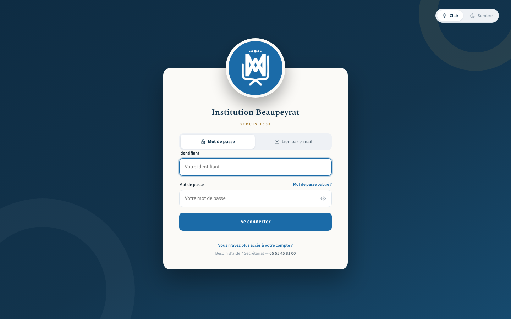

# MonCampus

A campus-management platform, mostly but not only pedagogical, deployed for **Institution Beaupeyrat** — a single [Symfony](https://symfony.com)
application served by [FrankenPHP](https://frankenphp.dev)/[Caddy](https://caddyserver.com) in worker
mode, plus a JSON API consumed by two companion Flutter apps.

Everyone signs in with their existing LDAP account and lands on a dashboard built for their role:
students, teachers, staff, and the external tutors who supervise apprentices.

<p align="center">
  
</p>

## What it does

**Identity**
- **LDAP authentication with just-in-time provisioning.** Users authenticate against the school's
  directory; their identity is mirrored into a local `User` row on every login, so the rest of the app
  attaches relations to a stable entity instead of a transient LDAP identity. No password is ever stored
  locally.
- **Mobile and passwordless sign-in.** The Flutter apps authenticate over `POST /api/login` and carry a
  JWT; a mailed magic link covers the case of someone who cannot reach the LDAP password.
- **Annuaire.** Browse LDAP users, groups, services and computers, and queue account/group/password
  requests for the external provisioning script that owns writes to the directory.

**Teaching**
- **Formations.** Everything hanging off a `Program` (a cohort in a given school year): enrolled
  students and teachers, timetable, syllabus, sequences, reporting, exports and per-program settings.
- **Travail à faire.** Assignments with expected productions, per-deadline student submissions, and a
  board that tells each student exactly what is due, late, or done.
- **Cahier de texte** with time-based visibility, **carnet de notes** with evaluation periods and student
  self-assessment, and **progression pédagogique** anchored on topics.
- **Quiz.** A teacher library, launched instances that snapshot their questions, several question types
  (including cloze), CSV/Kahoot import, and a live multiplayer mode over Mercure.
- **Outils.** Random draw, balanced group creation under constraints, and audio recordings with
  listening-progress tracking.

**Apprenticeship & careers**
- **UFA.** Alternance periods, the Livret Alternant and its four-role signature workflow
  (tutor / apprentice / teaching team / follow-up officer), evaluations, reminders, PDF export, and
  laptop loans.
- **Recherche d'emploi et stages.** Student démarches, training offers and applications with free-form
  attachments, and a staff-side reading view.

**Communication**
- **Courrier pro.** Real mailboxes for students on the school domain, inbound and outbound through
  Amazon SES, with administrable aliases.
- **Messagerie, annonces, agenda et listes d'inscription**, all addressed through the same audience
  resolver.
- **Support.** A ticket queue with categories, reachable even by someone locked out of their account.

**e-CO** — a companion orienteering-race module (courses, checkpoints, live tracking, statistics) with
its own mobile app; runners take part with no account at all.

## Tech stack

| Layer       | Choice                                                                              |
|-------------|-------------------------------------------------------------------------------------|
| Runtime     | [FrankenPHP](https://frankenphp.dev) (worker mode) behind Caddy, one container       |
| Framework   | Symfony 8.1 (PHP 8.5), Doctrine ORM 3 + Migrations                                   |
| Database    | MySQL 8                                                                              |
| Auth        | `symfony/ldap` with JIT provisioning; LexikJWT for the mobile API; magic links       |
| Front end   | Twig, Stimulus + Turbo, DataTables; a `cm-*` design system layered over Tabler       |
| Real time   | Mercure (Turbo streams, live quiz sessions)                                          |
| Storage     | Amazon S3 via Flysystem                                                              |
| Mail        | Amazon SES for delivery, S3 + SQS for inbound capture                                |
| PDF         | Gotenberg                                                                            |
| Analytics   | Matomo, consent-gated                                                                |
| i18n        | French (default) and English, locale persisted per user                              |
| Local dev   | Docker Compose, with `openldap`, Mailpit and phpMyAdmin stand-ins                    |

## Getting started

1. Install [Docker Compose](https://docs.docker.com/compose/install/) (v2.10+).
2. Build the images: `docker compose build --pull --no-cache`
3. Start the stack: `docker compose up --wait`
4. Open `https://localhost` and accept the auto-generated dev TLS certificate.
5. Sign in with an LDAP account (see `frankenphp/ldap/examples/` for the seed data shape — real
   directory data is kept out of version control, see below).
6. Stop everything with `docker compose down --remove-orphans`.

Useful day-to-day commands:

```console
docker compose exec php bash                  # shell into the app container
docker compose exec php composer <command>    # run Composer
docker compose exec php bin/console <command> # run a Symfony console command
docker compose exec -e APP_ENV=test php bin/phpunit
```

Production uses a separate overlay and must list `-f` flags in this order:

```console
docker compose -f compose.yaml -f compose.prod.yaml build --pull --no-cache
docker compose -f compose.yaml -f compose.prod.yaml up --wait
```

Several application commands are meant to run on a schedule in production — notably
`app:mail:consume-inbound`, `app:mail:consume-events` and `app:mail:reconcile`, which move the Courrier
école mail through SQS. Commands prefixed `app:seed-dev-*` / `app:dev:*` populate a local database and
are for development machines only.

## Configuration

Everything environment-specific is driven by `.env` (committed defaults) / `.env.local` (uncommitted
overrides) — see `docs/options.md` for the Caddy/FrankenPHP options. Beyond the LDAP connection
(`LDAP_HOST`, `LDAP_PORT`, `LDAP_BASE_DN`, `LDAP_SEARCH_DN`, `LDAP_SEARCH_PASSWORD`, which point at the
bundled `openldap` container in dev), the app expects credentials for S3 (`AWS_S3_*`), SES and the mail
pipeline (`AWS_MAIL_*`, `AWS_SES_*`), Mercure, Gotenberg, Matomo and the JWT key pair.

> **Note on LDAP seed data.** Only `frankenphp/ldap/examples/` (fake names) is version-controlled. Any
> other `.ldif` file placed alongside it — with real directory data — is gitignored on purpose and must
> never be committed.

> **Note on `.env.prod.local`.** The copy on a development machine holds decoy values. It is not a
> record of the real production configuration.

## Repository layout

```
src/Controller/     HTTP controllers, one per feature area (+ src/Controller/Api/ for the mobile API)
src/Entity/         Doctrine entities
src/Repository/     Query objects
src/Service/        Application services — most business rules live here
src/Security/       LDAP authenticators, StructureAccessChecker, Voters, LDAP syncers
src/Command/        Console commands (mail pipeline, imports, dev seeding)
src/Enum/           Backed enums for domain states
src/Twig/           Twig extensions (navigation, formatting, access helpers)
templates/          Twig templates, one subdirectory per feature area
assets/controllers/ Stimulus controllers
assets/styles/      app.css — the cm-* design system
assets/tabler/      Vendored Tabler CSS/JS
public/hugerte/     Vendored HugeRTE editor (unhashed on purpose — see CLAUDE.md)
migrations/         Doctrine migrations
design/             Design handoffs used as the visual reference (gitignored, not shipped)
```

## Deployment

Pushing to `main` triggers `.github/workflows/deploy.yaml`, which connects to the school VPN, SSHes into
the production host and runs `deploy-prod.sh` there. That script is intentionally not version-controlled
and lives only on the server. Day-to-day work lands on `staging`.

See `CLAUDE.md` for the full set of architecture notes, domain map and coding conventions.

## License

Copyright (C) 2026 Sébastien Tharaud.

MonCampus is free software, licensed under the **GNU Affero General Public License, version 3 or
later** — see [LICENSE](LICENSE).

In short: you may run, study, modify and redistribute it freely. If you modify it **and** offer it to
others over a network, you must make your modified source available to those users. Running an
unmodified copy places no obligation on you beyond pointing your users at this repository.

The names, logos and emblems of Institution Beaupeyrat are **not** covered by the licence, and the
project bundles third-party components under their own (permissive) licences — see [NOTICE](NOTICE)
for both, including attribution to
[dunglas/symfony-docker](https://github.com/dunglas/symfony-docker), from which the Docker/Caddy
plumbing was originally scaffolded.
